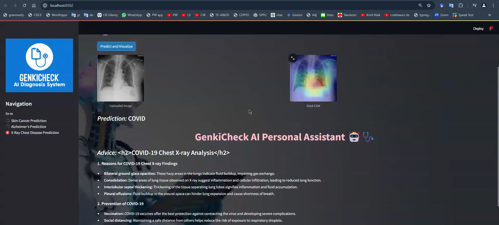

# GenkiCheck

GenkiCheck is a healthcare application that uses deep learning models to predict various diseases from medical images such as X-rays and MRI scans. The application also provides medical insights through an integrated chatbot feature.

## Features

- **Disease Prediction:** Predicts diseases such as Skin cancer, COVID-19, Pneumonia, and Tuberculosis from skin lesion images, X-ray images and Alzheimer's from MRI scans.
- **Grad-CAM Visualization:** Provides Grad-CAM heatmaps to highlight areas of interest in the X-ray images.
- **Chatbot Integration:** Offers medical advice and insights based on the predictions.
- **Streamlit Web Interface:** User-friendly web interface for uploading images and viewing predictions.

## Models

The following models are used in the application:

1. **Xception Model for X-ray Classification**
   - **Path:** `models/xception_weights_tf_dim_ordering_tf_kernels.h5`
   - **Diseases:** Normal, COVID-19, Tuberculosis, Pneumonia

2. **VGG16 Model for Skin Cancer Classification**
   - **Path:** `models/skin.h5`
   - **Diseases:** Benign, Malignant

3. **SVM Model for Alzheimer's Disease Classification**
   - **Path:** `models/svm_alzheimer_model.joblib`
   - **Categories:** Mild Demented, Moderate Demented, Non Demented, Very Mild Demented

